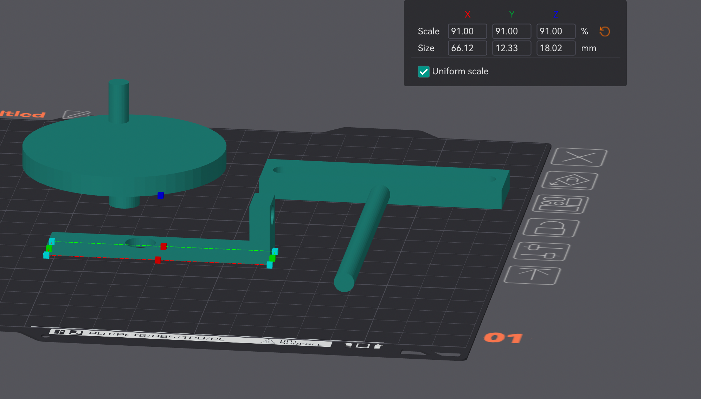

# A5 Futur tech design


#### The Helicoradian
" The shy plant that retracts when you approach "

# Technical documentation : 


## English version 🇬🇧

## Introduction

This project simulates an extraterrestrial botanical garden where the plants react to nearby movements. The concept is that when an object is detected within 10 cm by an ultrasonic sensor, the artificial plant automatically retracts. This behavior is controlled by an Arduino board and two servomotors to give the illusion of life and movement.

## Components Used

- Arduino Uno
- Ultrasonic sensor(HC-SR04)
- Servo motor for circular movement
- Servo motor for linear movement
- Connecting wires
- Breadboard (prototype board)


## Tools Used

- Arduino IDE: Used to write, compile, and upload code to the Arduino Uno board, making program development and testing easier.

- Required Libraries:

Servo: This library allows for control of servomotors, which is essential for the linear and circular movements of the plant in this project. By including #include <Servo.h>, the library provides commands to adjust the position and speed of the servomotors, contributing to the plant's reactive behavior.


## Wiring Diagram

Ultrasonic Sensor :

Trigger → Pin 9 de l’Arduino
Echo → Pin 8 de l’Arduino

Motors :

Circular servo motor (servoCircle) → Pin 6
FT90R motor (serving as linear motor) → Pin 5

## Arduino Code

### Code Explanation

The Arduino code controls the plant's reactions based on the distance detected by the ultrasonic sensor.

```
#include <Servo.h>

Servo servoCircle;
Servo servoLinear;

const int ultrasonicTrigger = 9;
const int ultrasonicEcho = 8;

void setup() {
  Serial.begin(9600);
  pinMode(ultrasonicTrigger, OUTPUT);
  pinMode(ultrasonicEcho, INPUT);
  servoCircle.attach(6);
  servoCircle.write(-1);
  servoLinear.attach(5);
  servoLinear.write(90);
}

void loop() {
  long duration, distance;

  digitalWrite(ultrasonicTrigger, LOW);  
    delayMicroseconds(2);  
    digitalWrite(ultrasonicTrigger, HIGH);  
    delayMicroseconds(10);  
    digitalWrite(ultrasonicTrigger, LOW); 

  duration = pulseIn(ultrasonicEcho, HIGH);
  distance = microsecondsToCentimeters(duration);

  //Serial.println(distance);
  //Serial.println(servoLinear.read());

  if (distance < 10 && servoLinear.read() != -180) {
    servoLinear.write(-180);
    servoCircle.detach();
  } else if (distance > 10 && servoLinear.read() != 180) {
    servoLinear.write(180);
    servoCircle.attach(6);
    servoCircle.write(-1);
  }

  delay(100);
}

long microsecondsToCentimeters(long microseconds) {
  return (microseconds / 2) / 29.1 ;
}
```
### Explanation of Main Functions

1. Setup :

- The ```setup()``` function configures the pins of the ultrasonic sensor for distance detection: ````ultrasonicTrigger``` as output to send signals and ultrasonicEcho as input to receive returning echoes.

- Motors are also initialized :
    . The circular motor (servoCircle), connected to pin 6, is configured with a low speed to simulate a gentle, continuous movement of the plant when it is at rest.
    . The linear motor (servoLinear), attached to pin 5, is set to a stable starting position (initial position at 90), allowing the plant to remain still until detection occurs.

2. Loop :

- Distance Measurement:
    . The ultrasonic sensor sends pulses and measures the echo return time to determine the distance between the plant and the closest object. The distance is then converted into centimeters via the ```microsecondsToCentimeters``` function.

- Plant Reaction Based on Distance:
    - When the distance is less than 10 cm :
        .The linear motor increases its speed (position set to 180), causing a rapid retraction of the plant to simulate a withdrawal reaction
        .Simultaneously, the circular motor is temporarily disconnected (using the ```detach()``` function), stopping any circular motion to enhance the retraction effect.
    - When the distance goes back over 10 cm :
        .The linear motor slows down and resumes a slower movement (position set to -180), allowing the plant to gradually return to an open position
        .The circular motor is reconnected (```attach()```) and resumes its gentle circular movement at a low speed, recreating the effect of a relaxed plant in the absence of nearby objects.

- Delay: A 100 ms delay is applied between each iteration to ensure smooth updates and avoid too frequent motor speed changes.

3. Auxiliary Function - Distance Conversion :

```microsecondsToCentimeters()``` : This function takes the echo return time in microseconds and converts it to distance in centimeters, simplifying decision-making based on the measured distance.


### Mechanism of the Reactive Plant

1. Continuous Circular Motion:

The circular motor (servo motor) makes a continuous, subtle motion as long as no detection occurs. This motion simulates a resting state for the plant.

2. Proximity Detection and Retraction :

    . As soon as an object is detected within 10 cm, the linear motor accelerates to cause a quick retraction of the plant, while the circular motion temporarily stops.
    . When the object moves away, the linear motor gradually reduces its speed, allowing the plant to extend again, and the circular motor resumes its continuous motion.

3. Explanation of Parts



In the image above, the different 3D printed pieces for the mechanism assembly are :

Circular Piece (top left) :

 This piece is the base attached to the servomotor to create circular motion. 

Articulated Arm (bottom of the image):

This arm is connected to the linear motor to perform the retraction and extension of the plant. It consists of multiple sections for ease of movement and includes attachment points.

T-shaped Arm Support:

This "T" structure allows for securing the arm and supports the motor, controlling the direction and amplitude of the linear movement. The upper bar of the piece helps maintain the arm's balance while in motion.


Additionally, we added a small paper piece to help the T-shaped part maintain its axis. Over time and with repeated rotations, we observed that the part tends to lose alignment, which is an issue we’re working to address.


## French version 🇫🇷

## Introduction

Ce projet simule un jardin botanique extraterrestre dans lequel les plantes réagissent aux mouvements proches.L'idée de notre projet est lorsqu'un objet est détecté à moins de 10 cm par un capteur à ultrasons, la plante artificielle se rétracte automatiquement. Ce comportement est contrôlé par une carte Arduino et deux servomoteurs pour donner l'illusion de vie et de mouvement.

## Composants utilisés

- Arduino Uno
- Capteur à ultrasons (HC-SR04)
- Servomoteur pour mouvement circulaire
- Servomoteur pour mouvement linéaire
- Fils de connexion
- Breadboard (plaque de prototypage)

## Outils utilisés

- Arduino IDE : utilisé pour écrire, compiler et téléverser le code sur la carte Arduino Uno, facilitant le développement et les tests du programme.

- Bibliothèques nécessaires :

Servo : permet de contrôler les servomoteurs, ce qui est essentiel pour les mouvements linéaires et circulaires de la plante dans le projet. En incluant #include <Servo.h>, la bibliothèque offre des commandes pour ajuster la position et la vitesse des servomoteurs, contribuant ainsi à la réactivité de la plante.


## Schéma de câblage

Capteur Ultrason :

Trigger → Pin 9 de l’Arduino
Echo → Pin 8 de l’Arduino
Moteurs :

Servomoteur circulaire (servoCircle) → Pin 6
Moteur FT90R (servant de moteur linéaire) → Pin 5

## Code Arduino

### Explication du code

Le code Arduino contrôle les réactions de la plante en fonction de la distance détectée par le capteur à ultrasons.

```
#include <Servo.h>

Servo servoCircle;
Servo servoLinear;

const int ultrasonicTrigger = 9;
const int ultrasonicEcho = 8;

void setup() {
  Serial.begin(9600);
  pinMode(ultrasonicTrigger, OUTPUT);
  pinMode(ultrasonicEcho, INPUT);
  servoCircle.attach(6);
  servoCircle.write(-1);
  servoLinear.attach(5);
  servoLinear.write(90);
}

void loop() {
  long duration, distance;

  digitalWrite(ultrasonicTrigger, LOW);  
    delayMicroseconds(2);  
    digitalWrite(ultrasonicTrigger, HIGH);  
    delayMicroseconds(10);  
    digitalWrite(ultrasonicTrigger, LOW); 

  duration = pulseIn(ultrasonicEcho, HIGH);
  distance = microsecondsToCentimeters(duration);

  //Serial.println(distance);
  //Serial.println(servoLinear.read());

  if (distance < 10 && servoLinear.read() != -180) {
    servoLinear.write(-180);
    servoCircle.detach();
  } else if (distance > 10 && servoLinear.read() != 180) {
    servoLinear.write(180);
    servoCircle.attach(6);
    servoCircle.write(-1);
  }

  delay(100);
}

long microsecondsToCentimeters(long microseconds) {
  return (microseconds / 2) / 29.1 ;
}
```
### Explication des fonctions principales

1. Setup :

- La fonction ```setup()``` configure les pins du capteur à ultrasons pour détecter les distances : ```ultrasonicTrigger``` comme sortie pour envoyer les signaux et ```ultrasonicEcho``` comme entrée pour recevoir les échos de retour.

- Les moteurs sont également initialisés :
    . Le moteur circulaire (servoCircle), connecté à la pin 6, est configuré avec une vitesse faible  pour simuler un mouvement léger et continu de la plante lorsque celle-ci est en position de repos.
    . Le moteur linéaire (servoLinear), attaché à la pin 5, est placé dans une position de départ stable (position initiale à 90), permettant à la plante de rester immobile tant qu’aucune détection n’est faite.

2. Loop :

- Mesure de la distance :
    . Le capteur ultrasonique envoie des impulsions et mesure le temps de retour de l’écho pour déterminer la distance entre la plante et l’objet le plus proche. La distance est ensuite convertie en centimètres via la fonction ```microsecondsToCentimeters```

- Réaction de la plante en fonction de la distance :
    - Lorsque la distance est inférieure à 10 cm :
        .Le moteur linéaire augmente sa vitesse (position réglée sur 180), provoquant une rétraction rapide de la plante, simulant une réaction de retrait face à l’objet.
        .Simultanément, le moteur circulaire est temporairement déconnecté ( avec la fonction ```detach()``` ), interrompant tout mouvement circulaire pour accentuer l'effet de rétraction.
    - Lorsque la distance repasse au-dessus de 10 cm :
        .Le moteur linéaire réduit sa vitesse et reprend un mouvement plus lent (position réglée sur -180), permettant à la plante de revenir progressivement en position ouverte.
        .Le moteur circulaire est reconnecté ```(attach())``` et reprend son léger mouvement circulaire à vitesse faible, recréant l’effet d’un relâchement de la plante en l'absence de proximité immédiate.

- Délai : Un délai de 100 ms est appliqué entre chaque itération pour assurer une mise à jour fluide et éviter des changements de vitesse trop fréquents des moteurs.

3. Fonction auxiliaire - Conversion de distance :

```microsecondsToCentimeters()``` : Cette fonction prend le temps de retour de l’écho en microsecondes et le convertit en distance en centimètres, simplifiant ainsi la prise de décision en fonction de la distance mesurée.


### Mécanisme de Fonctionnement de la Plante Réactive

1. Mouvement circulaire continu :

Le moteur circulaire (servomoteur) effectue un mouvement continu et subtil tant qu'aucune détection n'est faite. Ce mouvement simule un état de repos pour la plante.

2. Détection de proximité et rétraction :

    . Dès qu’un objet est détecté à moins de 10 cm, le moteur linéaire accélère pour provoquer une rétraction rapide de la plante, tandis que le mouvement circulaire s’arrête temporairement.
    . Lorsque l'objet s’éloigne, le moteur linéaire réduit progressivement sa vitesse, permettant à la plante de se déployer de nouveau, et le moteur circulaire reprend son mouvement continu.

3. Explication des pièces


Dans l'image ci-dessus, les différentes pièces imprimées en 3D pour le montage du mécanisme sont :

Pièce circulaire (en haut à gauche) :

 Cette pièce est la base qui s'attache au servomoteur pour créer le mouvement circulaire. 

Bras articulé (en bas de l'image) :

 Ce bras est relié au moteur linéaire pour effectuer la rétraction et le déploiement de la plante. Il est composé de plusieurs sections pour faciliter le mouvement et intègre des points de fixation.

Support du bras en forme de « T » : 

Cette structure en "T" permet de fixer le bras et supporte le moteur, contrôlant la direction et l’amplitude du mouvement linéaire, la barre ers le haut de la pièces sert à conserver l'équilibre du bras lorsqu'il est en mouvement


De plus, nous avons ajouté une petite pièce en papier pour aider la pièce en forme de "T" à maintenir son axe. Au fur et à mesure des rotations, nous avons observé que la pièce a tendance à se désaxer, ce qui constitue un souci que nous cherchons à résoudre.


## link to the powerpoint presentation

https://www.canva.com/design/DAGVy8p-f7k/eEpWMHlNS9noL6AoSR2WYA/edit?utm_content=DAGVy8p-f7k&utm_campaign=designshare&utm_medium=link2&utm_source=sharebutton
