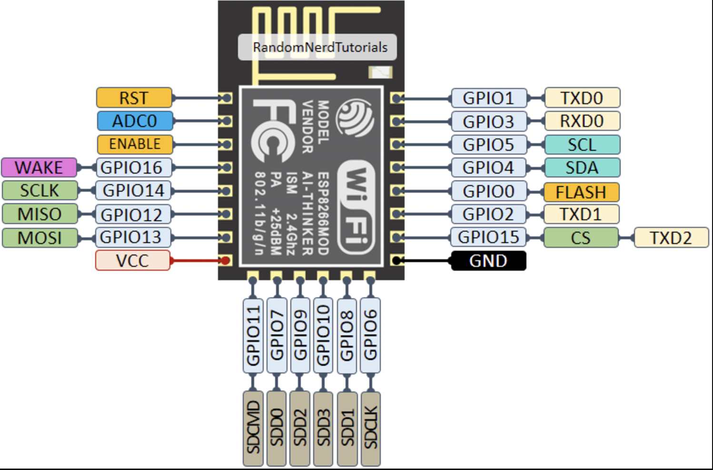

# rube_goldberg_machine

# Documentation technique

## Introduction

Ce projet simule une machine de Rube Goldberg, une chaîne de réactions mécaniques comprenant des éléments interactifs en réseau tel que des enceinte, leds, ou autre . Les microcontrôleurs ESP8266 jouent un rôle central pour coordonner certaines étapes via un réseau Wi-Fi. Chaque action si nécessaire est déclenchée en chaîne, selon un ordre géré par le serveur.
Chaque étape du mécanisme déclenche la suivante, illustrant un processus complexe pour accomplir une tâche simple.

## Composants utilisés

- ESP8266 : Un pour le serveur, et plusieurs pour les potentiels clients.
- Éléments mécaniques : Ils traduisent les actions des ESP8266 en mouvements physiques.
-  Capteur à ultrasons (HC-SR04)
- Servomoteur
- haut parleur (buzzer connecté)
- Chemins en pailles : Guident les billes entre les étapes.
- Bille en métal : Élément déclencheur principal.

## Schéma de câblage

une esp8266 se présente comme ceci au début:



#### ESP8266 Serveur :

#### ESP8266 Clients :

## Code Arduino

### Explication du code

#### Code serveur `ftd_server.ino` :

#### Résumé :

- Initialisation du réseau Wi-Fi : L’ESP8266 serveur crée un réseau Wi-Fi local.
- Gestion des clients : Il détecte les clients qui se connectent, les enregistre, et coordonne leurs actions via UDP.
- Transmission des messages : Envoie des signaux pour démarrer ou passer à l'étape suivante.

code :

```c
#include <ESP8266WiFi.h>
#include <WiFiUDP.h>
#include <map>

const char* ssid = "ESPsoftAP_01";
const char* password = "ESP-WIFI-PW";
const uint16_t udpPort = 9999;
WiFiUDP udp;
const uint8_t resetBtnPin = 2;
bool reset = false;
unsigned char packetBuffer[255];
std::map<uint8_t, IPAddress> clients;
int marbleCircuitIndex = -1;

void setup() {
  Serial.begin(9600);
  WiFi.softAP(ssid, password);
  udp.begin(udpPort);
  pinMode(resetBtnPin, INPUT_PULLUP);
}

void loop() {
  int packetSize = udp.parsePacket();
  if (packetSize) {
    int len = udp.read(packetBuffer, 255);
    IPAddress address = udp.remoteIP();
    uint8_t index;

    if (IsFirstConnection(address, &index)) {
      clients.emplace(index, address);
      marbleCircuitIndex = index;
      StartMarbleCircuit(index, address);
    } else if (len > 0 && index == marbleCircuitIndex) {
      std::map<uint8_t, IPAddress>::iterator it = clients.find(marbleCircuitIndex);
      if (it != clients.end()) {
        udp.beginPacket(address, udpPort);
        udp.write(0);
        udp.endPacket();
        ++it;
        if (it != clients.end()) StartMarbleCircuit(it->first, it->second);
      }
    }
  }

  if (!digitalRead(resetBtnPin)) {
    if (!reset) {
      clients.clear();
      marbleCircuitIndex = -1;
      reset = true;
    }
  } else reset = false;
}

bool IsFirstConnection(const IPAddress& address, uint8_t* outIndex) {
  for (auto& client : clients) {
    if (client.second == address) {
      *outIndex = client.first;
      return false;
    }
  }
  *outIndex = 0;
  return true;
}

void StartMarbleCircuit(uint8_t index, IPAddress address) {
  marbleCircuitIndex = index;
  udp.beginPacket(address, udpPort);
  udp.write(1);
  udp.endPacket();
}
```

#### Explication des fonctions principales :

`setup()`:

Configure l'ESP8266 en tant que point d'accès Wi-Fi.

Initialise le protocole UDP pour la communication.

`loop()`:

Vérifie les messages UDP entrants.

Enregistre de nouveaux clients s'ils ne sont pas déjà dans la liste.

Si un message vient du client actuel, passe au client suivant et envoie des instructions.

Surveille le bouton de réinitialisation pour effacer la liste des clients et réinitialiser le système.

`IsFirstConnection()`:

Vérifie si une adresse IP est déjà enregistrée comme client.

Retourne un index unique pour chaque nouveau client.

`StartMarbleCircuit()`:

Envoie une commande au client concerné pour démarrer une nouvelle étape du circuit.

#### Code client `ftd_client.ino` :

#### Résumé :

- Connexion au serveur : L’ESP8266 client se connecte au réseau Wi-Fi du serveur.
- Gestion des messages : Le client reçoit des messages du serveur pour lancer une action ou signaler une erreur.
- Exécution des actions :
  - Le client contrôle un servo moteur (porte) pour gérer la bille.
  - Utilise des capteurs ultrasoniques pour détecter la bille et déclencher d’autres actions, comme jouer de la musique ou allumer une LED.

code :

```c
#include <ESP8266WiFi.h>
#include <WiFiUDP.h>
#include <Servo.h>

const int bpin = 5; 
const int musicSensors[3][2] = {
  { 2, 0 }, 
  { 12, 13 }, 
};

WiFiUDP Client;
bool isFirstMessage = true;  
uint8_t selfIndex = 1;       
char packetBuffer[255];

Servo door;
bool ballCanGo = true;  

void setup() {
  Serial.begin(115200);
  pinMode(bpin, INPUT_PULLUP);
  door.attach(4); 
  for (auto& sensorPin : musicSensors) {
    pinMode(sensorPin[0], OUTPUT);
    pinMode(sensorPin[1], INPUT);
  }
}

void loop() {
  if (!WiFi.isConnected()) {
    connectToWifi();
  }

  int packetSize = Client.parsePacket();
  if (packetSize) {
    Serial.println("A message is received.");
    int len = Client.read(packetBuffer, 255);
    if (len > 0) {
      if (packetBuffer[0] == 1 && !ballCanGo) ballCanGo = true;
      if (packetBuffer[0] == 0) {}  
    };
    Serial.print(packetBuffer);
    Serial.println("\n");
  }

  int bstate = digitalRead(bpin);
  if (bstate == LOW && !isFirstMessage && ballCanGo) sendMessage((char*)1);

  if (ballCanGo) {
    if (door.attached()) {
      door.write(8);
      delay(800);
      door.write(180);
      delay(800);
      door.detach();
    }

    int index = 0;
    for (auto& sensorPin : musicSensors) {
      digitalWrite(sensorPin[0], LOW);
      delay(10);
      digitalWrite(sensorPin[0], HIGH);
      delay(10);
      digitalWrite(sensorPin[0], LOW);

      long duration = pulseIn(sensorPin[1], HIGH);
      long distance = microsecondsToCentimeters(duration);
      if (distance < 10) {
        if (index == 0) playMusic();
        if (index == 1) {}  
      }
      index++;
    }
  }
  delay(500);
}

void connectToWifi() {
  const char* ssid = "ESPsoftAP_01";
  const char* password = "ESP-WIFI-PW";

  WiFi.begin(ssid, password);
  Serial.print("Connecting to ");
  Serial.print(ssid);
  Serial.println(" ...");

  int i = 0;
  while (WiFi.status() != WL_CONNECTED) {
    delay(1000);
    Serial.println(++i);
  }

  Serial.println('\n');
  Serial.println("Connection established!");
  Serial.print("IP address:\t");
  Serial.println(WiFi.localIP());

  if (isFirstMessage) sendMessage((char*)&selfIndex);
}

void sendMessage(char* message) {
  int udpPort = 9999;
  Client.begin(udpPort);
  Serial.print(F("UDP Client : "));
  Serial.println(WiFi.localIP());

  Client.beginPacket("192.168.4.1", udpPort);
  Serial.print("Sent : ");
  Serial.println(message);

  Client.write(message);
  Client.write("\r\n");
  Client.endPacket();
}

long microsecondsToCentimeters(long microseconds) {
  return (microseconds / 2) / 29.1;
}

void playMusic() {
  int notes = sizeof(melody) / sizeof(melody[0]) / 2;
  int wholenote = (60000 * 4) / tempo;
  int divider = 0, noteDuration = 0;

  for (int thisNote = 0; thisNote < notes * 2; thisNote = thisNote + 2) {
    divider = pgm_read_word_near(melody + thisNote + 1);
    if (divider > 0) {
      noteDuration = (wholenote) / divider;
    } else if (divider < 0) {
      noteDuration = (wholenote) / abs(divider);
      noteDuration *= 1.5;
    }
    tone(buzzer, pgm_read_word_near(melody + thisNote), noteDuration * 0.9);
    delay(noteDuration);
    noTone(buzzer);
  }
}
```

#### Explication des fonctions principales :

```setup()``` :
- Configure le client ESP8266.
- Initialise le servo moteur attaché à GPIO4 (D2).
- Configure les capteurs ultrasoniques pour détecter la bille.

```loop()``` :
- Vérifie les messages reçus via UDP :
  - Active ```ballCanGo``` si le message reçu est valide.
- Lit l'état du bouton :
    - Envoie un message au serveur si le bouton est pressé.
- Contrôle les événements du circuit :
  - Ouvre/ferme la porte avec le servo moteur.
  - Utilise les capteurs ultrasoniques pour détecter la bille et déclencher des actions comme jouer une musique.

```connectToWifi()``` :
- Connecte le client au réseau Wi-Fi et envoie un message d’identification.

```sendMessage()``` :
- Envoie des messages UDP au serveur.

```playMusic()``` :
- Joue une mélodie de Noël en utilisant un buzzer connecté.

## Mechanisme de fonctionnement du circuit :

- la porte bascule pour laisser passer la bille
- la bille se déplace dans le circuit en passant par les pailles
- la bille tombe dans un récipient , qui fait office de frein 
- la bille passe ensuite dans un gobelet qui bascule lorsque la bille passe dedans
- la bille tombe das une partie métallique en pente, fait un virage vers un chemin de paille 
- la bille arrive à une plaque de métallique, la bille étant en métal, elle est conductrice, elle ferme le circuit et déclancer le haut parleur (buzzer connecté) configuré pour émettre un son de noël, chaque note correspond à une fréquence comme on l'a vu dans le code ci-dessus.
