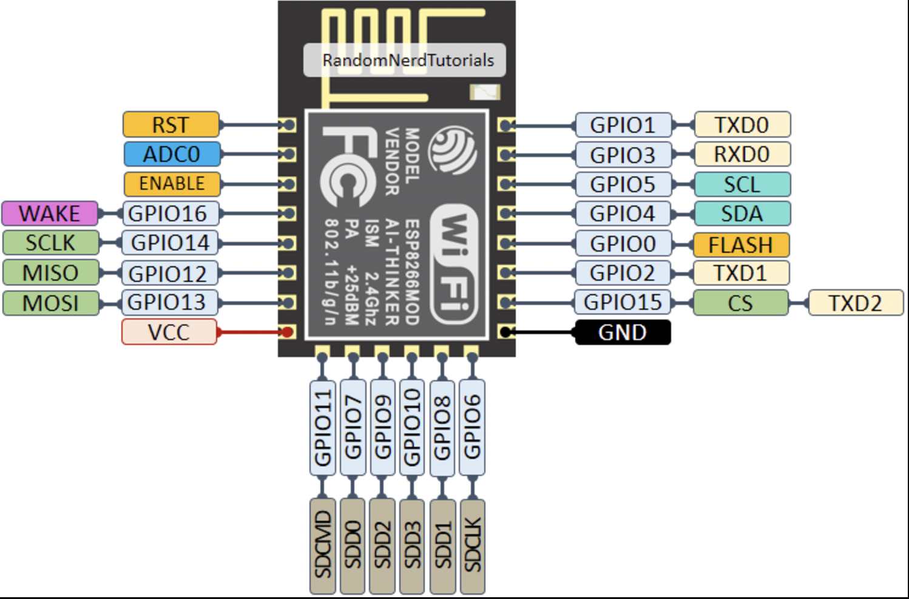
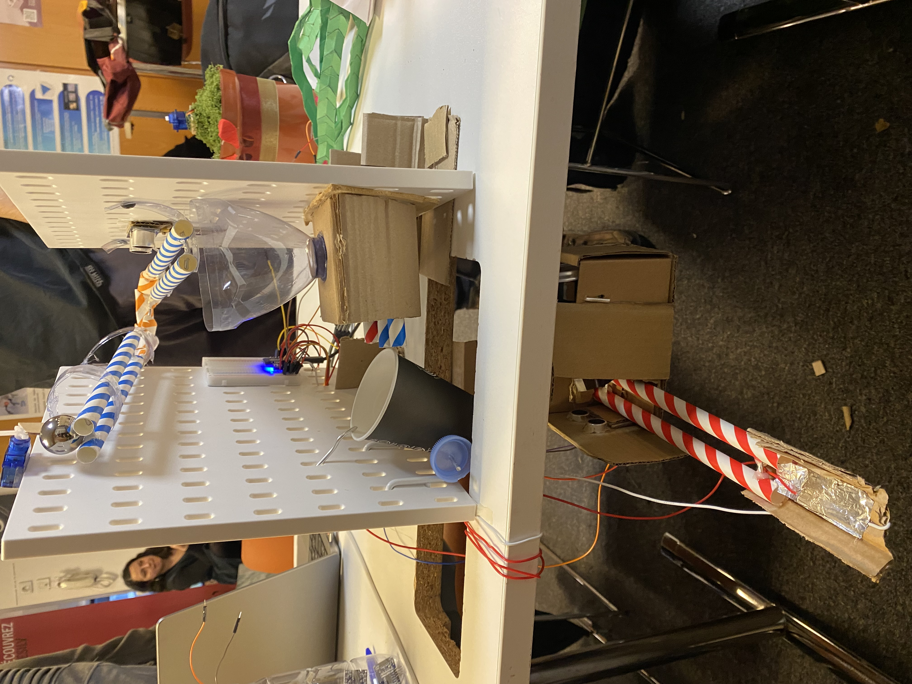

# rube_goldberg_machine

# Technical Documentation

## Introduction

This project simulates a Rube Goldberg machine, a chain of mechanical reactions including interactive network elements such as ultrasonic sensors, an LED, a speaker, and a button. The ESP8266 microcontrollers play a central role in coordinating some stages via a Wi-Fi network. Each action, if necessary, is triggered sequentially, in an order managed by the server. Each step of the mechanism triggers the next one, illustrating a complex process to accomplish a simple task.

## Components Used

- ESP8266: One for the server, and several for potential clients.
- Metal Marble: The main triggering element.
- Straw Paths: Guide the marbles between steps.
- Mechanical Elements: They translate the actions of the ESP8266 into physical movements.
- Ultrasonic Sensor (HC-SR04)
- An LED
- Servo Motor
- Metal Plate: Used to detect the marble and trigger the buzzer.
- Speaker (connected buzzer)

## Wiring Diagram

An ESP8266 initially looks like this:



#### ESP8266 Server:

#### ESP8266 Clients:

## Arduino Code

### Code Explanation

#### Server Code `ftd_server.ino`:

#### Summary:

- Wi-Fi Network Initialization: The ESP8266 server creates a local Wi-Fi network.
- Client Management:
  - The server detects connected clients, registers them with a unique identifier, and manages their progression in the circuit.
  - Controls the access of new clients if a circuit is already in progress.
- Message Transmission:
  - Sends a signal to start a client's circuit.
  - Waits for an end of circuit signal to move to the next client.
  - Resets the state when a button is pressed.

code:

see ```ftd_server.ino```

#### Explanation of Main Functions:

`setup()`:
- Configures the ESP8266 as a Wi-Fi access point.
- Initializes the UDP protocol for communication with clients.
- Configures the pins for the start button and status LEDs.

`loop()`:

- Checks if a start button is pressed when clients are connected:
  - Starts the circuit by sending a command to the first client in the list.
  - Displays connected clients and their IP addresses in the serial monitor.
- Manages incoming UDP messages:
  - Registers a new client if an initial connection is detected.
  - Moves to the next client if a client signals the end of its circuit.
  - Displays received messages and their senders in the serial monitor.
- Manages LED blinking:
  - The status LED blinks while a circuit is in progress.
  - The built-in LED blinks when clients are connected but no circuit is active.
- Resets the server when the reset button is pressed.

`IsFirstConnection()`:

- Checks if an IP address is already registered as a client.
- Returns a unique index for each new client.

`StartMarbleCircuit()`:
- Sends a command to the identified client to start a new circuit stage.
- Updates the current client index in the list.

#### Client Code `ftd_client.ino`:

#### Summary:

- Connection to the Server: The ESP8266 client connects to the server's Wi-Fi network.
- Message Management: The client receives messages from the server to launch an action or signal an error.
- Execution of Actions:
  - The client controls a servo motor (gate) to manage the marble.
  - Uses ultrasonic sensors to detect the marble and trigger other actions:
  - Playing music via a buzzer.
  - Activating a "dancing" mechanism (additional servo motors).
  - Lighting up an LED to signal the marble’s passage.

code:

see ```ftd_client.ino```

#### Explanation of Main Functions:

```setup()```:
- Configures the ESP8266 client.
- Initializes the servo motor attached to GPIO4 (D2) to open and close the gate. Initializes two other servo motors:
  - GPIO14 (D5): Controls the rotation of a mechanism simulating a helicoradian (rotational movement).
  - GPIO16 (D0): Controls the vertical movement of the mechanism.
- Configures connected ultrasonic sensors (GPIO2, GPIO12, etc.) to detect the marble at different spots on the course.
- Configures the button connected to GPIO5 (D1) to monitor its state and signal that the course is complete.

```loop()```:
- Checks for UDP messages:
  - If a valid message is received from the server (value of packetBuffer[0] == 1), activates ballCanGo, enabling circuit events.
  - Manages error messages (placeholder for packetBuffer[0] == 0).

- Reads the state of the button:
  - If the button is pressed (```bstate == LOW```), sends a message to the server to indicate the course is complete.
- Controls circuit events:

- If ```ballCanGo``` is active:
  - Opens and closes the gate with the servo motor to let the marble pass.
  - Uses ultrasonic sensors to detect the marble at various stages:
    - Sensor 1: Detects the marble when it is detected at a distance less than 10 cm and:
      - Triggers music via the buzzer.
      - Activates the movement of two new servo motors:
        - Servo heliup (vertical movement): Moves to 180°.
        - Servo helispin (rotational movement): Moves to 8°.
    - Sensor 2: Detects the marble on a metal slope and lights up an LED.

```connectToWifi()```:
- Connects the ESP8266 client to the configured Wi-Fi network.
- Sends an identification message to the server after a successful connection.

```sendMessage()```:
- Sends UDP messages to the server to signal a state or progression in the circuit.

```playMusic()```:
- Plays a Christmas melody with a connected buzzer.
- Each note corresponds to a specific frequency, defined in the `melody` array in the code.

## Circuit Operation Mechanism:

Photo of final setup:



***Gate Opening***:
The gate tilts thanks to a servo motor, allowing the marble to start its path.

***Movement in the Circuit***: The marble moves through a path made of straws, guided by the circuit slope.

***Braking in a Container***:
- Detection via sensor 1:
  - When the marble is detected at a distance less than 10 cm:
    - The buzzer plays a Christmas melody.
    - The helicoradian mechanism performs a vertical movement (heliup servo) and a rotation (helispin servo).

- The marble falls into a container that acts as a temporary brake, slowing down its speed.

***Activation of the Tilting Cup***: The marble passes into a cup designed to tilt when it enters, thereby releasing the marble to the next stage.

***Passage on a Metal Slope***: The marble continues its path on a metal slope, making a turn to join a new segment of straws.
  - Sensor 2: Before reaching the container, the marble is detected at a distance less than 10 cm, triggering the lighting of an LED.

***Detection on a Metal Plate***: The marble arrives on a metal plate and presses a connected button. This:
- Sends a message to the server to indicate that the course is complete.